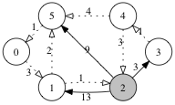

# Assignment 4 - CS 4071 - Spring 2018

*Due: 2018-04-04*  
*Group #13: Robert DiMartino (dimartrt), Hayden Schiff (schiffha), Jeremiah Leak (leakjz)*

<div style="page-break-after: always;"></div>

## 1. Exercise 6.5

**Problem**: Solve the following instance of the knapsack problem for capacity $C=30$.

|   $i$   |  0   |  1   |  2   |  3   |  4   |  5   |  6   |  7   |
| :-----: | :--: | :--: | :--: | :--: | :--: | :--: | :--: | :--: |
| $v_{i}$ |  60  |  50  |  40  |  30  |  20  |  10  |  5   |  1   |
| $w_{i}$ |  30  | 100  |  10  |  10  |  8   |  8   |  1   |  1   |

To solve this knapsack problem, we want to greedily select objects of decreasing densities, i.e. the ratio of value to weight, $v_{i}/w_{i}$, until the knapsack is full. So first we compute the densities for each object.

|      $i$      |  0   |  1   |  2   |  3   |  4   |  5   |  6   |  7   |
| :-----------: | :--: | :--: | :--: | :--: | :--: | :--: | :--: | :--: |
| $d_{i} = v_{i}/w_{i}$ |  2   | 0.5  |  4   |  3   | 2.5  | 1.25 |  5   |  1   |

Then we repeatedly select available objects with the next highest density until the knapsack is full (or we run out of items).

0. Starting capacity: 30
1. Select: 6 ($d=5, w=1$), fraction: 1, remaining capacity: 29
2. Select: 2 ($d=4, w=10$), fraction: 1, remaining capacity: 19
3. Select: 3 ($d=3, w=10$), fraction: 1, remaining capacity: 9
4. Select: 4 ($d=2.5, w=8$), fraction: 1, remaining capacity: 1
5. Select: 0 ($d=2, w=30$), fraction: 1/30, remaining capacity: 0

The fractions, $f_{i}$, of each item that yield the optimal value for the knapsack are provided in the table below.

|      $i$      |  0   |  1   |  2   |  3   |  4   |  5   |  6   |  7   | Total |
| :-----------: | :--: | :--: | :--: | :--: | :--: | :--: | :--: | :--: | :--: |
| $f_{i}$ |  1/30  | 0  |  1   |  1   | 1  | 0 |  1   |  0   | |
| $f_{i}v_{i}$ | 2 | 0 | 40 | 30 | 20 | 0 | 5 | 0 | 97 |
| $f_{i}w_{i}$ | 1 | 0 | 10 | 10 | 8 | 0 | 1 | 0 | 30 |

## 2. Exercise 6.9

**Problem**: Trace the action of _HuffmanCode_ for the letters _a, b, c, d, e, f, g, h_ occuring with frequencies 10, 7, 3, 5, 9, 2, 3, 2.


0. Initial forest

    ```mermaid
    graph TD
        %% unallocated
        a:10
        b:7
        c:3
        d:5
        e:9
        f:2
        g:3
        h:2
    ```

1. Stage 1

	```mermaid
    graph TD
        %% stage 1
        n1((4))---f:2
        n1---h:2

        %% unallocated
        a:10
        b:7
        c:3
        d:5
        e:9
        f:2
        g:3
  ```

2. Stage 2

    ```mermaid
    graph TD
        %% stage 1
        n1((4))---f:2
        n1---h:2
        %% stage 2
        n2((6))---c:3
        n2---g:3

        %% unallocated
        a:10
        b:7
        d:5
        e:9
    ```

3. Stage 3

    ```mermaid
    graph TD
        %% stage 1
        n1((4))---f:2
        n1---h:2
        %% stage 3
        n3((9))---n1
        n3---d:5

        %% stage 2
        n2((6))---c:3
        n2---g:3

        %% unallocated
        a:10
        b:7
        e:9
    ```

4. Stage 4

    ```mermaid
    graph TD
        %% stage 1
        n1((4))---f:2
        n1---h:2
        %% stage 3
        n3((9))---n1
        n3---d:5

        %% stage 2
        n2((6))---c:3
        n2---g:3
        %% stage 4
        n4((13))---n2
        n4---b:7

        %% unallocated
        a:10
        e:9
    ```

5. Stage 5

    ```mermaid
    graph TD

        %% stage 1
        n1((4))---f:2
        n1---h:2
        %% stage 3
        n3((9))---n1
        n3---d:5
        %% stage 5
        n5((18))---n3
        n5---e:10

        %% stage 2
        n2((6))---c:3
        n2---g:3
        %% stage 4
        n4((13))---n2
        n4---b:7

        %% unallocated
        a:10
    ```

6. Stage 6

    ```mermaid
    graph TD
        %% stage 1
        n1((4))---f:2
        n1---h:2
        %% stage 3
        n3((9))---n1
        n3---d:5
        %% stage 5
        n5((18))---n3
        n5---e:10
        %% stage 6
        n6((23))---n4
        n6---a:10

        %% stage 2
        n2((6))---c:3
        n2---g:3
        %% stage 4
        n4((13))---n2
        n4---b:7
    ```

7. Stage 7: Huffman Tree

    ```mermaid
    graph TD
        %% stage 1
        n1((4))---|0| f:2
        n1---|1| h:2
        %% stage 3
        n3((9))---|0| n1
        n3---|1| d:5
        %% stage 5
        n5((18))---|0| n3
        n5---|1| e:10
        %% stage 6
        n6((23))---|0| n4
        n6---|1| a:10
        %% stage 2
        n2((6))---|0| c:3
        n2---|1| g:3
        %% stage 4
        n4((13))---|0| n2
        n4---|1| b:7
        %% stage 7
        n7((41))---|0| n5
        n7---|1| n6
    ```

| letter | frequency | encoding |
| :--: | :--: | :--: |
| _a_ | 10 |`11`|
| _b_ | 7  |`101`|
| _c_ | 3  |`1000`|
| _d_ | 5  |`001`|
| _e_ | 9  |`01`|
| _f_ | 2  |`0000`|
| _g_ | 3  |`1001`|
| _h_ | 2  |`0001`|

## 3. Exercise 6.10

**Problem**: Given the Huffman Code Tree in Figure 6.6, decode the string `100111100001101111001`.

> **Figure 6.6**
> | letter | frequency | encoding |
> | :--: | :--: | :--: |
> | _a_ | 9 |`01`|
> | _b_ | 8  |`00`|
> | _c_ | 5  |`101`|
> | _d_ | 3  |`1001`|
> | _e_ | 15  |`11`|
> | _f_ | 2  |`1000`|

We read binary characters from the encoded string one at a time. Because the Huffman Code is a prefix code, when the binary substring we've read matches one of the letter encodings from Figure 6.6, we can unambiguously determine which letter is decoded.

Reading the string from the front:

1. `1001` = _d_ 
2. `11` = _e_
3. `1000` = _f_
4. `01` = _a_
5. `101` = _c_
6. `11` = _e_
7. `1001` = _d_

Then `100111100001101111001` decoded is "defaced".

## 4.

Consider the following weighted graph $G$.


### a)

**Problem**: Trace the action of procedure `Kruskal` for G.

1. Stage 1
  


2. Stage 2
  


3. Stage 3
  


4. Stage 4
  


5. Stage 5
  


6. Stage 6
  


7. Stage 7
  

### b)

**Problem**: Trace the action of procedure `Prim` for G, with r = 1.

0. Stage 0
  |i|0|1|2|3|4|5|6|7|
  |:--:|:--:|:--:|:--:|:--:|:--:|:--:|:--:|:--:|
  |nearest[i]|4|0|7|inf|inf|3|inf|9|
  |parent[i]|1|-1|1|-|-|1|-|1|
  |inTree[i]|F|T|F|F|F|F|F|F|
  Weight = 0
  


1. Stage 1
  |i|0|1|2|3|4|5|6|7|
  |:--:|:--:|:--:|:--:|:--:|:--:|:--:|:--:|:--:|
  |nearest[i]|2|0|7|inf|6|3|2|9|
  |parent[i]|5|-1|1|-|5|1|5|1|
  |inTree[i]|F|T|F|F|F|T|F|F|
  Weight = 3
  


2. Stage 2
  |i|0|1|2|3|4|5|6|7|
  |:--:|:--:|:--:|:--:|:--:|:--:|:--:|:--:|:--:|
  |nearest[i]|2|0|7|inf|6|3|2|3|
  |parent[i]|5|-1|1|-|5|1|5|0|
  |inTree[i]|T|T|F|F|F|T|F|F|

  Weight = 5

  

3. Stage 3
  |i|0|1|2|3|4|5|6|7|
  |:--:|:--:|:--:|:--:|:--:|:--:|:--:|:--:|:--:|
  |nearest[i]|2|0|7|inf|6|3|2|3|
  |parent[i]|5|-1|1|-|5|1|5|0|
  |inTree[i]|T|T|F|F|F|T|T|F|
  Weight = 7
  


4. Stage 4
  |i|0|1|2|3|4|5|6|7|
  |:--:|:--:|:--:|:--:|:--:|:--:|:--:|:--:|:--:|
  |nearest[i]|2|0|7|inf|6|3|2|3|
  |parent[i]|5|-1|1|-|5|1|5|0|
  |inTree[i]|T|T|F|F|F|T|T|T|
  Weight = 10
  


5. Stage 5
  |i|0|1|2|3|4|5|6|7|
  |:--:|:--:|:--:|:--:|:--:|:--:|:--:|:--:|:--:|
  |nearest[i]|2|0|3|2|6|3|2|3|
  |parent[i]|5|-1|4|4|5|1|5|0|
  |inTree[i]|T|T|F|F|T|T|T|T|
  Weight = 16
  


6. Stage 6
  |i|0|1|2|3|4|5|6|7|
  |:--:|:--:|:--:|:--:|:--:|:--:|:--:|:--:|:--:|
  |nearest[i]|2|0|3|2|6|3|2|3|
  |parent[i]|5|-1|4|4|5|1|5|0|
  |inTree[i]|T|T|F|T|T|T|T|T|
  Weight = 18
  


7. Stage 7
  |i|0|1|2|3|4|5|6|7|
  |:--:|:--:|:--:|:--:|:--:|:--:|:--:|:--:|:--:|
  |nearest[i]|2|0|3|2|6|3|2|3|
  |parent[i]|5|-1|4|4|5|1|5|0|
  |inTree[i]|T|T|T|T|T|T|T|T|
  Weight = 21
  
## 5.


### a)

**Problem**: Trace the action of procedure Dijkstra for the digraph with initial vertex $r = 2$.

0. Stage 0
  |i|0|1|2|3|4|5|
  |:--:|:--:|:--:|:--:|:--:|:--:|:--:|
  |dist[i]|inf|13|0|3|inf|9|
  |parent[i]|-|2|-1|2|-|2|
  |inTree[i]|F|F|T|F|F|F|
  


1. Stage 1
  |i|0|1|2|3|4|5|
  |:--:|:--:|:--:|:--:|:--:|:--:|:--:|
  |dist[i]|inf|13|0|3|4|9|
  |parent[i]|-|2|-1|2|3|2|
  |inTree[i]|F|F|T|T|F|F|
  


2. Stage 2
  |i|0|1|2|3|4|5|
  |:--:|:--:|:--:|:--:|:--:|:--:|:--:|
  |dist[i]|inf|13|0|3|4|8|
  |parent[i]|-|2|-1|2|3|4|
  |inTree[i]|F|F|T|T|T|F|
  


3. Stage 3
  |i|0|1|2|3|4|5|
  |:--:|:--:|:--:|:--:|:--:|:--:|:--:|
  |dist[i]|9|13|0|3|4|8|
  |parent[i]|5|2|-1|2|3|4|
  |inTree[i]|F|F|T|T|T|T|
  


4. Stage 4
  |i|0|1|2|3|4|5|
  |:--:|:--:|:--:|:--:|:--:|:--:|:--:|
  |dist[i]|9|12|0|3|4|8|
  |parent[i]|5|0|-1|2|3|4|
  |inTree[i]|T|F|T|T|T|T|
  


5. Stage 5
  |i|0|1|2|3|4|5|
  |:--:|:--:|:--:|:--:|:--:|:--:|:--:|
  |dist[i]|9|12|0|3|4|8|
  |parent[i]|5|0|-1|2|3|4|
  |inTree[i]|T|T|T|T|T|T|
  

Minimum spanning path:


### b)

**Problem**: Repeat for $r = 3$.

0. Stage 0
  |i|0|1|2|3|4|5|
  |:--:|:--:|:--:|:--:|:--:|:--:|:--:|
  |dist[i]|inf|inf|inf|0|1|inf|
  |parent[i]|-|-|-|-1|3|-|
  |inTree[i]|F|F|F|T|F|F|
  


1. Stage 1
  |i|0|1|2|3|4|5|
  |:--:|:--:|:--:|:--:|:--:|:--:|:--:|
  |dist[i]|inf|inf|4|0|1|5|
  |parent[i]|-|-|4|-1|3|4|
  |inTree[i]|F|F|F|T|T|F|
  


2. Stage 2
  |i|0|1|2|3|4|5|
  |:--:|:--:|:--:|:--:|:--:|:--:|:--:|
  |dist[i]|inf|17|4|0|1|5|
  |parent[i]|-|2|4|-1|3|4|
  |inTree[i]|F|F|T|T|T|F|
  


3. Stage 3
  |i|0|1|2|3|4|5|
  |:--:|:--:|:--:|:--:|:--:|:--:|:--:|
  |dist[i]|6|17|4|0|1|5|
  |parent[i]|5|2|4|-1|3|4|
  |inTree[i]|F|F|T|T|T|T|
  


4. Stage 4
  |i|0|1|2|3|4|5|
  |:--:|:--:|:--:|:--:|:--:|:--:|:--:|
  |dist[i]|6|9|4|0|1|5|
  |parent[i]|5|0|4|-1|3|4|
  |inTree[i]|T|F|T|T|T|T|
  


5. Stage 5
  |i|0|1|2|3|4|5|
  |:--:|:--:|:--:|:--:|:--:|:--:|:--:|
  |dist[i]|6|9|4|0|1|5|
  |parent[i]|5|0|4|-1|3|4|
  |inTree[i]|T|T|T|T|T|T|
  

Minimum spanning path:


## 6. Exercise 7.13

**Problem**: Verify formula (7.4.4).

$$
AB = \begin{bmatrix} a_{00} & a_{01} \\ a_{10} & a_{11} \end{bmatrix}
\begin{bmatrix} b_{00} & b_{01} \\ b_{10} & b_{11} \end{bmatrix}
=\begin{bmatrix} a_{00}b_{00}+a_{01}b_{10} & a_{00}b_{01}+a_{01}b_{11} \\ a_{10}b_{00}+a_{11}b_{10} & a_{10}b_{01}+a_{11}b_{11} \end{bmatrix} \\
AB \stackrel{?}{=} \begin{bmatrix} m_{1}+m_{4}-m_{5}+m_{7} & m_{3}+m_{5} \\ m_{2}+m_{4} & m_{1} +m_{3} - m_{2} + m_{6} \end{bmatrix} \\
\implies \begin{align}
\textrm{(1) } &a_{00}b_{00}+a_{01}b_{10} \stackrel{?}{=} m_{1}+m_{4}-m_{5}+m_{7} \\
\textrm{(2) } &a_{00}b_{01}+a_{01}b_{11} \stackrel{?}{=} m_{3}+m_{5} \\
\textrm{(3) } &a_{10}b_{00}+a_{11}b_{10} \stackrel{?}{=} m_{2}+m_{4} \\
\textrm{(4) } &a_{10}b_{01}+a_{11}b_{11} \stackrel{?}{=} m_{1} +m_{3} - m_{2} + m_{6}
\end{align}
$$

To verify 7.4.4, we need to verify each of its four equations, where:

$$
\begin{align}
m_{1} &= (a_{00}+a_{11})(b_{00}+b_{11}) &= &\ a_{00}b_{00}+a_{00}b_{11}+a_{11}b_{00}+a_{11}b_{11} \\
m_{2} &= (a_{10}+a_{11})(b_{00}) &= &\ a_{10}b_{00}+a_{11}b_{00} \\
m_{3} &= a_{00}(b_{01}-b_{11}) &= &\ a_{00}b_{01} - a_{00}b_{11} \\
m_{4} &= a_{11}(b_{10}-b_{00}) &= &\ a_{11}b_{10} - a_{11}b_{00} \\
m_{5} &= (a_{00}+a_{01})(b_{11}) &= &\ a_{00}b_{11} + a_{01}b_{11} \\
m_{6} &= (a_{10}-a_{00})(b_{00}+b_{10}) &= &\ a_{10}b_{00}+a_{10}b_{10}-a_{00}b_{00}-a_{00}b_{10} \\
m_{7} &= (a_{01}-a_{11})(b_{10}+b_{11}) &= &\ a_{01}b_{10}+a_{01}b_{11}-a_{11}b_{10}-a_{11}b_{11}
\end{align}
$$

1.
$$
m_{1}+m_{4}-m_{5}+m_{7} \\
= (a_{00}b_{00}+a_{00}b_{11}+a_{11}b_{00}+a_{11}b_{11})+(a_{11}b_{10} - a_{11}b_{00}) - ...\\(a_{00}b_{11} + a_{01}b_{11})+(a_{01}b_{10}+a_{01}b_{11}-a_{11}b_{10}-a_{11}b_{11}) \\
= a_{00}b_{00}+\cancel{a_{00}b_{11}}^{1}+\cancel{a_{11}b_{00}}^{2}+\cancel{a_{11}b_{11}}^{3}+\cancel{a_{11}b_{10}}^{4} - \cancel{a_{11}b_{00}}^{2} + ...\\ - \cancel{a_{00}b_{11}}^{1} - \cancel{a_{01}b_{11}}^{5}+a_{01}b_{10}+\cancel{a_{01}b_{11}}^{5}-\cancel{a_{11}b_{10}}^{4}-\cancel{a_{11}b_{11}}^{3} \\
= a_{00}b_{00}+a_{01}b_{10}
$$

2.
$$
m_{3}+m_{5} = (a_{00}b_{01} - a_{00}b_{11}) + (a_{00}b_{11} + a_{01}b_{11}) \\
= a_{00}b_{01} - \cancel{a_{00}b_{11}} + \cancel{a_{00}b_{11}} + a_{01}b_{11} \\
= a_{00}b_{01} + a_{01}b_{11}
$$

3.
$$
m_{2}+m_{4} = (a_{10}b_{00}+a_{11}b_{00}) + (a_{11}b_{10} - a_{11}b_{00}) \\
= a_{10}b_{00} + \cancel{a_{11}b_{00}} + a_{11}b_{10} - \cancel{a_{11}b_{00}} \\
= a_{10}b_{00} + a_{11}b_{10}
$$
4.
$$
m_{1} +m_{3} - m_{2} + m_{6} \\
= (a_{00}b_{00}+a_{00}b_{11}+a_{11}b_{00}+a_{11}b_{11}) + (a_{00}b_{01} - a_{00}b_{11}) +...\\-(a_{10}b_{00}+a_{11}b_{00}) + (a_{10}b_{00}+a_{10}b_{10}-a_{00}b_{00}-a_{00}b_{10} ) \\
= \cancel{a_{00}b_{00}}^{1}+ \cancel{a_{00}b_{11}}^{2}+ \cancel{a_{11}b_{00}}^{3}+a_{11}b_{11} +  \cancel{a_{00}b_{01}}^{4} -  \cancel{a_{00}b_{11}}^{2} +...\\- \cancel{a_{10}b_{00}}^{5}- \cancel{a_{11}b_{00}}^{3} +  \cancel{a_{10}b_{00}}^{5}+a_{10}b_{10}-\cancel{a_{00}b_{00}}^{1}- \cancel{a_{00}b_{10}}^{4} \\
= a_{10}b_{01}+a_{11}b_{11} 
$$
Since each of the four equations are true, formula 7.4.4 is verified.


## 7.

**Problem**: Design a greedy algorithm to solve the optimal merge pattern problem. In this problem, we have $n$ sorted files of lengths $f_{0}, f_{1}, ..., f_{n-1}$, and we wish to merge them into a single file by a sequence of merges of pairs of files. To merge two files of lengths $m_{1}$ and $m_{2}$ takes $m_{1} + m_{2}$ operations. Describe your algorithm in general, and illustrate it for files of lengths 10,7,3,5,9,2,3,2. (Can you make a connection with Huffman codes and Exercise 1 of this assignment?)

A key consideration is that files that are merged early in the process will continue to contribute to the number of operations needed for successive merges. For example:


The total number of operations to merge these three files is $(m_{2}+m_{3})+(m_{1}+m_{2}+m_{3})$. Notice that $m_{2}$ and $m_{3}$ contribute to the total twice as much $m_{1}$, because they were merged earlier in that process. With that in mind, to minimize the total number of operations, we need to perform the "cheapest" (fewest operations) merge at each stage.

For this algorithm, we will store the files in a priority queue where the smallest files have the highest priority. We dequeue and merge the smallest two files and place the result back in the priority queue. In this way, we will always be performing the merge with the fewest possible  operations at each stage, and the "repeated" files are selected to minimize the total number of operations.

**Example**

File lengths: 10,7,3,5,9,2,3,2


This algorithm is identical to the Huffman code algorithm. We are minimizing the weighted path length of the merge tree with respect to the length of the files, instead of the frequencies of words/characters.
